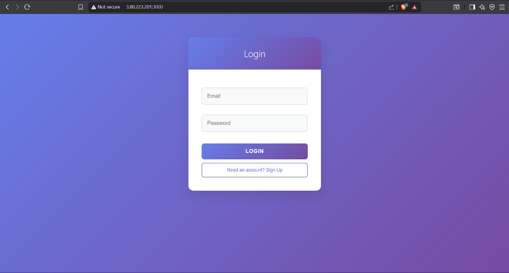
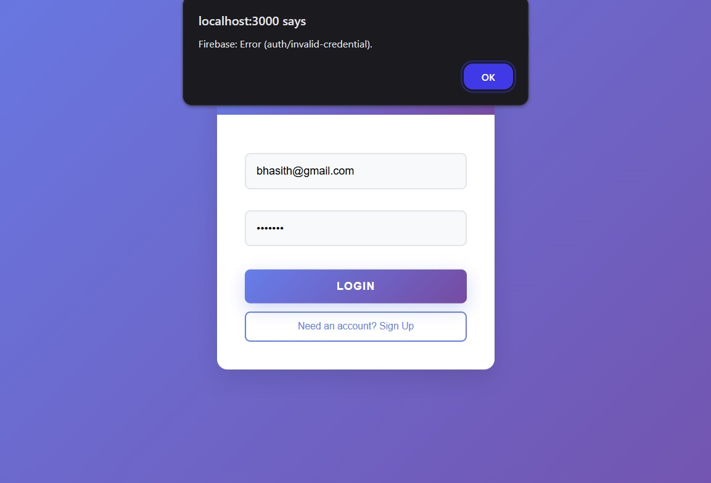
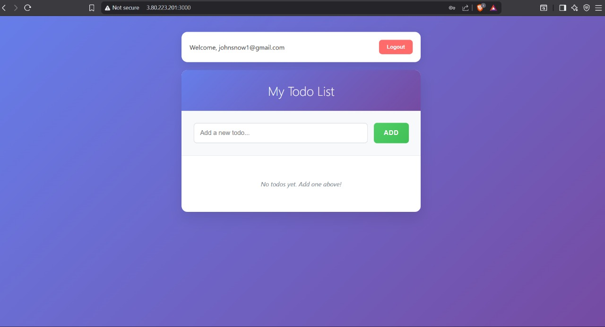
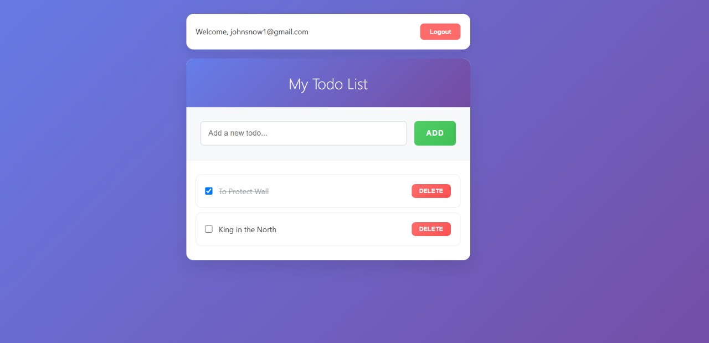

# 🚀 Todo DevOps Project

A full-stack Todo application demonstrating modern DevOps practices with containerization, cloud deployment, and CI/CD principles.

<div align="center">


</div>

## 📋 Table of Contents

- [Overview](#overview)
- [Tech Stack](#tech-stack)
- [Architecture](#architecture)
- [DevOps Implementation](#devops-implementation)
- [Prerequisites](#prerequisites)
- [Local Development](#local-development)
- [Docker Containerization](#docker-containerization)
- [AWS EC2 Deployment](#aws-ec2-deployment)
- [Features](#features)
- [Results](#results)
- [Future Enhancements](#future-enhancements)
- [Contributing](#contributing)

## 🎯 Overview

This project showcases a complete DevOps workflow by building, containerizing, and deploying a full-stack Todo application. The application demonstrates modern development practices including containerization with Docker, cloud deployment on AWS EC2, and secure authentication using Firebase.

**Key DevOps Highlights:**
- 🐳 **Containerization**: Separate Docker containers for frontend, backend, and database
- ☁️ **Cloud Deployment**: Hosted on AWS EC2 with public accessibility
- 🔐 **Security**: Environment-based configuration management
- 🏗️ **Microservices Architecture**: Decoupled frontend and backend services
- 📦 **Infrastructure as Code**: Docker Compose orchestration

## 🛠️ Tech Stack

### Frontend
- **React.js** - Modern UI 
- **CSS3** - Custom styling and responsive design
- **Firebase Authentication** - Secure user authentication

### Backend
- **Node.js** - Runtime environment
- **Express.js** - Web application framework
- **RESTful APIs** - Backend service architecture
- **Middleware** - Custom authentication and error handling

### Database
- **MongoDB** - NoSQL database for data persistence

### DevOps & Infrastructure
- **Docker** - Containerization platform
- **Docker Compose** - Multi-container orchestration
- **AWS EC2** - Cloud hosting platform
- **Git** - Version control


## 🏗️ Architecture

```
┌─────────────────┐    ┌─────────────────┐    ┌─────────────────┐
│   Frontend      │    │    Backend      │    │    Database     │
│   (React)       │◄──►│   (Node.js)     │◄──►│   (MongoDB)     │
│   Port: 3000    │    │   Port: 5000    │    │   Port: 27017   │
│   Docker        │    │   Docker        │    │   Docker        │
└─────────────────┘    └─────────────────┘    └─────────────────┘
         │                       │                       │
         └───────────────────────┼───────────────────────┘
                                 │
                    ┌─────────────────┐
                    │   AWS EC2       │
                    │   Instance      │
                    │   Public IPv4   │
                    └─────────────────┘
```

## 🚀 DevOps Implementation

### 1. Containerization Strategy

**Frontend Dockerfile:**
- Multi-stage build for optimized production image
- Nginx server for serving static React build
- Environment variables for Firebase config

**Backend Dockerfile:**
- Node.js runtime optimization
- Production dependencies only
- Health checks implementation

**Database:**
- Official MongoDB Docker image
- Persistent volume mounting
- Environment-based configuration

### 2. Container Orchestration

Using Docker Compose to manage multi-container application:
- Service discovery and networking
- Environment variable management
- Volume persistence
- Port mapping and exposure

### 3. Cloud Infrastructure

**AWS EC2 Deployment:**
- Ubuntu-based EC2 instance - t2.micro (free tier)
- Security group configuration for web traffic
- Public IPv4 accessibility
- Docker Engine installation and configuration


## 📋 Prerequisites

Before running this project, ensure you have:

- **Docker** (v20.0+) and **Docker Compose** (v2.0+)
- **Node.js** (v16+) for local development
- **Git** for version control
- **AWS Account** for cloud deployment
- **Firebase Project** for authentication

## 💻 Local Development

### 1. Clone the Repository

```bash
git clone https://github.com/Harsha-Vardhan2005/todo-devops.git
cd todo-devops
```

### 2. Environment Setup

Create `.env` files in both frontend and backend directories:

**Frontend (.env):**
```env
REACT_APP_FIREBASE_API_KEY=your_api_key
REACT_APP_FIREBASE_AUTH_DOMAIN=your_auth_domain
REACT_APP_FIREBASE_PROJECT_ID=your_project_id
REACT_APP_BACKEND_URL=http://localhost:5000
```

**Backend (.env):**
```env
MONGODB_URI=mongodb://localhost:27017/todoapp
PORT=5000
JWT_SECRET=your_jwt_secret
```

### 3. Install Dependencies

**Frontend:**
```bash
cd frontend
npm install
npm start
```

**Backend:**
```bash
cd backend
npm install
npm run dev
```

## 🐳 Docker Containerization

### Building Individual Images

**Frontend Image:**
```bash
cd frontend
docker build -t todo-frontend .
```

**Backend Image:**
```bash
cd backend
docker build -t todo-backend .
```

### Running with Docker Compose

```bash
# Build and start all services
docker-compose up --build

# Run in detached mode
docker-compose up -d

# View logs
docker-compose logs -f

# Stop all services
docker-compose down
```


### Docker Compose Configuration

The `docker-compose.yml` orchestrates three services:
- **Frontend**: React application (Port 3000)
- **Backend**: Node.js API (Port 5000)
- **Database**: MongoDB (Port 27017)

## ☁️ AWS EC2 Deployment

### 1. EC2 Instance Setup

```bash
# Update system packages
sudo yum update -y

# Install Docker
sudo yum install -y docker
sudo systemctl start docker
sudo systemctl enable docker
sudo usermod -aG docker ec2-user
newgrp docker

# Install Docker Compose
sudo curl -L "https://github.com/docker/compose/releases/download/v2.20.2/docker-compose-$(uname -s)-$(uname -m)" -o /usr/local/bin/docker-compose
sudo chmod +x /usr/local/bin/docker-compose
```

### 2. Deploy Application

```bash
# Clone repository
git clone https://github.com/Harsha-Vardhan2005/todo-devops.git
cd todo-devops

# Configure environment variables
# Create .env files with production values

# Deploy with Docker Compose
docker-compose up -d
```

### 3. Security Group Configuration

Configure AWS Security Group to allow:
- **HTTP (80)**: Web traffic
- **HTTPS (443)**: Secure web traffic
- **Custom TCP (3000)**: Frontend application
- **Custom TCP (5000)**: Backend API
- **SSH (22)**: Server management

## ✨ Features

### 🔐 Authentication
- **Firebase Authentication** integration
- Secure sign-up and sign-in functionality
- Email and password validation
- Session management


### 📝 Todo Management
- **Create Tasks**: Add new todo items
- **Mark Complete**: Toggle task completion status
- **Delete Tasks**: Remove unwanted items
- **Persistent Storage**: Data saved in MongoDB
- **User-specific**: Tasks tied to authenticated users


### 🎨 User Experience
- **Responsive Design**: Works on all device sizes
- **Intuitive UI**: Clean and user-friendly interface
- **Real-time Updates**: Instant feedback on actions
- **Personalized Greetings**: Welcome messages for users

## 📸 Results

### Application Flow

<!-- Add login page screenshot -->

<!-- Comment: Screenshot of the login/signin page -->

<!-- Add signup page screenshot -->

<!-- Comment: Screenshot of the user registration page -->

<!-- Add main dashboard screenshot -->

<!-- Comment: Screenshot of the main todo dashboard after login -->


<!-- Add completed todos screenshot -->

<!-- Comment: Screenshot showing completed tasks (ticked items) -->


## 🔄 DevOps Workflow

1. **Development**: Code written in separate frontend/backend directories
2. **Version Control**: Git for tracking changes and collaboration
3. **Containerization**: Docker images built for each service
4. **Orchestration**: Docker Compose manages multi-container deployment
5. **Cloud Deployment**: Application deployed on AWS EC2
6. **Scaling**: Ready for horizontal scaling with load balancers

## 🚀 Future Enhancements

- **CI/CD Pipeline**: GitHub Actions for automated testing and deployment
- **Kubernetes**: Container orchestration for production scaling
- **Monitoring**: Prometheus and Grafana for application metrics
- **Load Balancing**: NGINX for distributing traffic


---

**🌐 Live Application**: Access the deployed application at `http://your-ec2-public-ip:3000`


